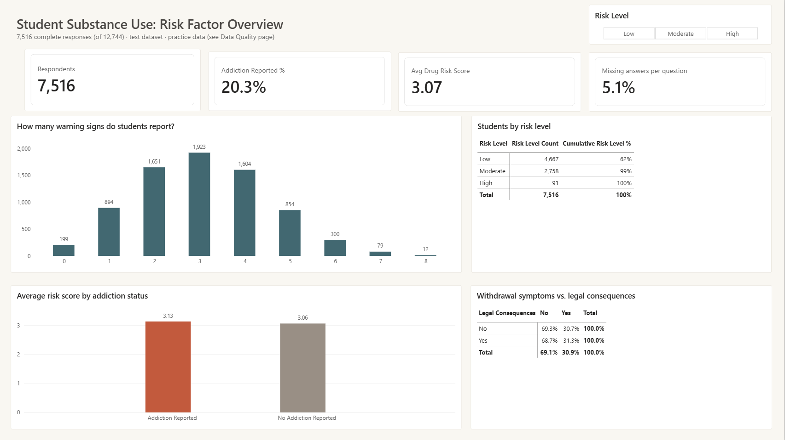
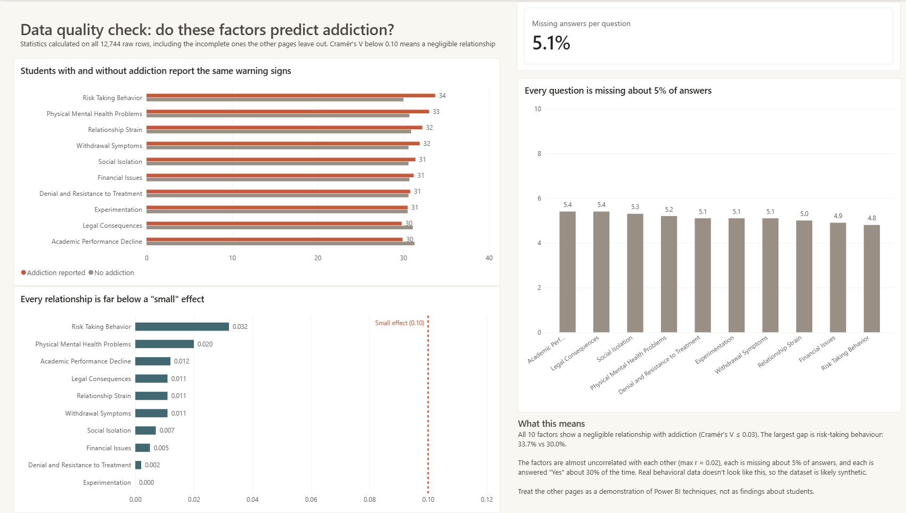
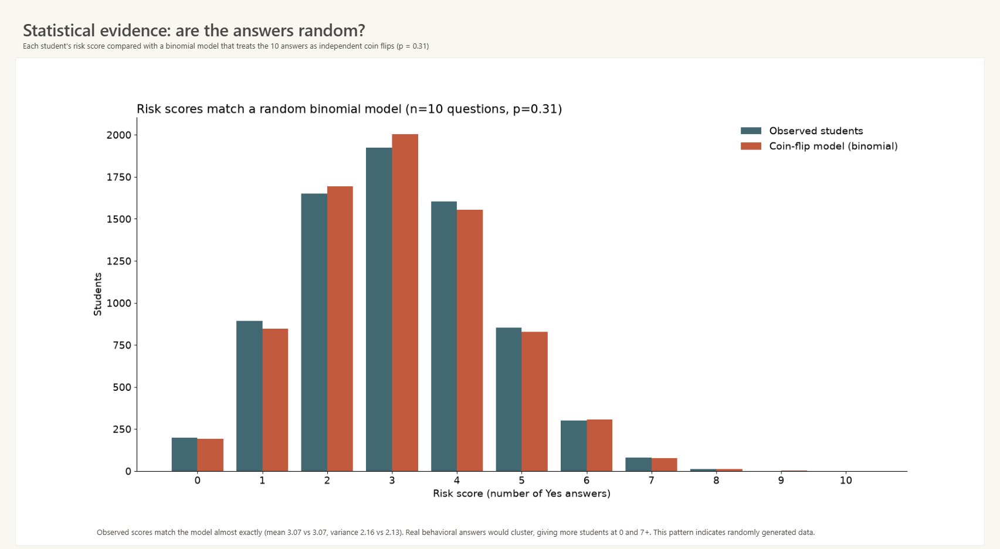

# Student Substance Use: Risk Factor Analysis

A five-page Power BI report, with Python and R analysis, that explores whether ten self-reported warning signs predict addiction among students. The main finding is about the data itself: statistical checks show the dataset behaves like randomly generated data, so the report documents that and treats the other pages as a technique demonstration.

## Key findings

- **7,516 complete responses** (of 12,744 rows) were analysed. **20.3%** reported addiction, and the average student reported **3.07** of 10 warning signs.
- **No warning sign meaningfully predicts addiction.** Every factor has a Cramér's V of **0.03 or less** (0.10 is the usual threshold for a "small" effect). The largest gap is risk-taking behaviour: 33.7% vs 30.0%.
- **The warning signs are unrelated to each other** (|r| ≤ 0.03). In real behavioural data, signs like withdrawal and denial cluster together.
- **Risk scores match a random binomial model almost exactly** (mean 3.07 vs 3.07, variance 2.16 vs 2.13). This is what you get when ten answers are independent coin flips with p ≈ 0.31.
- **Missing answers are spread evenly** (4.8%–5.4% per question), with no sign of the usual pattern where sensitive questions are skipped more often.

**Conclusion:** the dataset is very likely synthetic. The report says so on its Data Quality and Statistical Evidence pages rather than presenting its patterns as real findings about students.

## Report pages

| Page | What it shows |
|---|---|
| **Overview** | KPI cards, distribution of risk scores, risk-level breakdown, average score by addiction status |
| **Key Influencers** | Power BI's AI visual ranking which factors are associated with reported addiction |
| **Decomposition Tree** | Interactive breakdown of respondents by warning sign |
| **Data Quality** | Yes-rates by group, Cramér's V for each factor with a 0.10 threshold line, missing-data rates |
| **Statistical Evidence** | Python visual comparing observed risk scores with a binomial model |

## Tools and methods

- **Power BI:** Power Query cleaning (label mapping, null handling, index column), data modelling, DAX measures, custom theme, Key Influencers and Decomposition Tree visuals, Python visual
- **Python** (pandas, SciPy, matplotlib): descriptive statistics, correlation, binomial modelling, confidence intervals, t-test with effect size
- **R** (base R): the same analysis, section by section
- **Statistics:** frequency distributions, measures of centre and spread, correlation and simple linear regression, conditional probability, binomial and normal distributions, confidence intervals, two-group comparison (Welch's t-test, Cohen's d), Cramér's V

The Python and R scripts are organised by the modules of my Statistics and Data Analytics course (MATH 59854, Sheridan College), applying each topic to this dataset.

## Repository contents

| File | Description |
|---|---|
| `Goldenitz_Student_Substance_Use_Analysis.pbix` | Power BI report (open with Power BI Desktop) |
| `Goldenitz_Student_Substance_Use_Analysis.pdf` | Static PDF of all five pages |
| `Addiction_Stats_Python.ipynb` | Python notebook (runs in Google Colab or Jupyter) |
| `Addiction_Stats_R.R` | R script |
| `data_quality_stats.csv` | Per-factor statistics used on the Data Quality page |
| `Clean_Report_Theme.json` | Power BI theme (colours, fonts, borders) |
| `overview.png`, `data-quality.png`, `statistical-evidence.png` | Page screenshots |

## How to run

**Power BI:** open the `.pbix` in Power BI Desktop. To refresh the data, download the dataset (see below), then go to **Transform data → Data source settings → Change Source** and point it to your copy of `student_addiction_dataset_test.csv`. The Python visual needs Python with pandas, matplotlib and SciPy installed and set under **Options → Python scripting**.

**Python:** open the notebook in Google Colab, run the first cell and upload the CSV when prompted.

**R:** change the `setwd()` path at the top of the script to the folder containing the CSV, then run section by section.

## Data

Student drug addiction dataset (test split, 12,744 rows) from Kaggle: https://www.kaggle.com/datasets/atifmasih/students-drugs-addiction-dataset. Ten yes/no warning-sign questions and an addiction class label. Rows with any missing answer (41%) were excluded from the main report pages; the data-quality statistics use all rows.

## Author

**Michael Goldenitz** · Applied Data Analytics and Visualization, Sheridan College · HBSc Psychology and Philosophy, University of Toronto Mississauga
[LinkedIn](https://www.linkedin.com/in/michael-goldenitz-790509265/)
